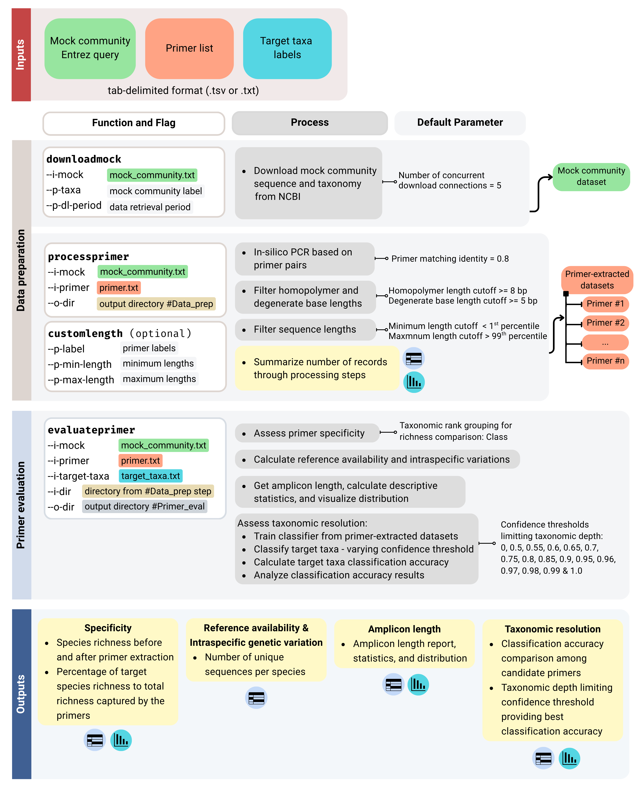

# YAne: a high-<ins>Y</ins>ielding primer <ins>A</ins>ssessment a<ins>n</ins>d database construction tool for <ins>e</ins>DNA metabarcoding

# Introduction
YAne is a python package for eDNA metabarcoding primer evaluation and database construction.
This package is equiped with functions to perform data retrieval from NCBI (mock community), simulate *in-silico* PCR based on primer pairs, filter homopolymers, degenerate bases and sequence lengths, and evaluate primer performance based on specificity, amplicon length, reference database availability, and taxonomic resolution. Simultaneously, primer-specific databases are constructed in a format of Naive Bayes classifiers to be used for taxonomic assignment with QIIME2.

# Package installation
**1. Download package (Unix)**: https://anonymous.4open.science/r/YAne-1406

**2. Install package dependencies and create environment**

We used a Conda environment configuration file (`environment.yml`) to manage all software dependencies. In the package's main directory, execute the following command to download all dependencies and create a new conda environment called `yane-2026.1`.

```bash
conda env create -f environment.yml
```

**3. Activate conda environment**

```bash
conda activate yane-2026.1
```

# Overview of the workflow & required functions and flags



# Inputs

User-defined input tables are required to indicate **mock community** and **primer pairs** for *in-silico* PCR, and **target taxa** for primer evaluation. All tables must be in a **tab-delimited** file format.

We define mock community, primer pairs and target taxa as:
* **Mock community**: sequence and taxonomic information of organisms assumed to be in the environment prior to extraction with primers.
* **Primer pairs**: forward and reverse sequences (5'-3') of all candidate primers
* **Target taxa**: target organisms for detection with eDNA metabarcoding using the candidate primers


*As demonstration, we used vertebrates as our mock community, and 8 primer pairs on 12S, 16S, and D-loop to conduct *in-silico* PCR against the mock community. Cetaceans (whales and dolphins) and Sirenians (dugongs and manatees) are our target taxa we aimed to detect with eDNA metabarcoding.*

**Table 1** File paths of inputs in the example dataset

| Input | Table file path |
| :--- | :--- |
| **Mock community** | `examples/mock_community.txt` |
| **Primer pairs** | `examples/primer.txt` |
| **Target taxa** | `examples/cetacean.txt` |

## 1. Mock community
* A mock community table is consisted of **mock label(s)** and **NCBI Entrez query search string(s)** (See **Table 2**). The labels and Entrez queries are strictly arranged as first and second columns as shown in the example table.

* [NCBI Entrez](https://www.ncbi.nlm.nih.gov/books/NBK3837/) is used to indicate which mock community and genetic compartments to be downloaded from the NCBI database. Large download (more than 100 requests) need to be done on weekends or between 9 pm and 5 am Eastern Time weekdays according to [NCBI Policy](https://www.ncbi.nlm.nih.gov/home/about/policies/). 

* Many mock communities can be downloaded simultaneously by adding more rows to the table and specify their labels. Users can use the primer table to indicate the mock community that primers will be extracted from.

* The table must be saved **tab-delimited** file format (See: `examples/mock_community.txt`), which will be used as an input for the functions `downloadmock`, `processprimer` and `evaluateprimer`. 

*As demonstration, we used vertebrate (*txid7742[Organism]*) mitochondrial DNA of all lengths and regions (*mitochondrion[filter]*) as our mock community and filtered the records that are environmental samples and unclassified (*NOT uncultured[Title] NOT unclassified[Title] NOT unidentified[Title] NOT unverified[Title]*).*

**Table 2** An example of a mock community table

| mock label | NCBI Entrez |
| :--- | :--- |
| mtDNA | txid7742[Organism] AND mitochondrion[filter] NOT "environmental samples"[Title] NOT "environment"[Title] NOT uncultured[Title] NOT unclassified[Title] NOT unidentified[Title] NOT unverified[Title] |

## 2. Primer pairs
* A primer table is consisted of **primer labels**, **mock community labels** (indicate the mock that primers will be extracted from and must be similar to the labels in the mock community table), **forward primer sequences** (5' to 3'), and **reverse primer sequences** (5' to 3'). The columns must be strictly arranged like the ones shown in **Table 3**.
* This table must be in **tab-delimited** file format (See `examples/primer.txt`) and will be used as an input for the functions `processprimer` and `evaluateprimer`.

*In this study, we used 8 candidate primers on 12S, 16S and D-loop to do in-silico PCR against a single vertebrate mock community called mtDNA.*

**Table 3** An example of a primer table.
    
| primer | mock | forward | reverse |
| :--- | :--- | :--- | :--- |
| MiFishU | mtDNA | GTCGGTAAAACTCGTGCCAGC | CATAGTGGGGTATCTAATCCCAGTTTG |
| MarVer1 | mtDNA | CGTGCCAGCCACCGCG | GGGTATCTAATCCYAGTTTG |
| V12SU | mtDNA | GTGCCAGCNRCCGCGGTYANAC | ATAGTRGGGTATCTAATCCYAGT |
| Vert01 | mtDNA | TTAGATACCCCACTATGC | TAGAACAGGCTCCTCTAG |
| Mamm01 | mtDNA | CCGCCCGTCACCCTCCT | GTAYRCTTACCWTGTTACGAC |
| MarVer3 | mtDNA | AGACGAGAAGACCCTRTG | GGATTGCGCTGTTATCCC |
| V16SU | mtDNA | ACGAGAAGACCCYRYGRARCTT | TCTHRRANAGGATTGCGCTGTTA |
| dlp1.5dlp4 | mtDNA | TCACCCAAAGCTGRARTTCTA | GCGGGWTRYTGRTTTCACG |


## 3. Target taxa
* A target taxa table is used to specify targets that you aim to detect with candidate primers based on eDNA metabarcoding. 
* This table consisted of a **header** indicating **taxonomic level** that the target taxa labels belong to (Taxonomic level (case-sensitive): Kingdom, Phylum, Class, Order, Family, Genus, or Species only). 
* The table **contents** are **target taxa labels** that cover all of the target species. Taxa names are based on the [NCBI Taxonomy Database](https://www.ncbi.nlm.nih.gov/taxonomy) , which can be searched through the [NCBI Taxonomy Browser](https://www.ncbi.nlm.nih.gov/datasets/taxonomy/tree/). The table's file name will be further used for file names of the primer evaluaiton results.

*We used cetaceans and sirenians family names as our taxa labels as they covered all species in this group.*

**Table 4** An example of target taxa table. 

| Family | 
| :--- |
| Balaenopteridae |
| Delphinidae |
| Phocoenidae |
| Monodontidae |
| Ziphiidae |
| Balaenidae |
| Platanistidae |
| Trichechidae |
| Physeteridae |
| Lipotidae |
| Eschrichtiidae |
| Iniidae |
| Pontoporiidae |
| Dugongidae |
| Neobalaenidae |

# Data preparation
## 1. Download mock community
The function `downloadmock` downloads and dereplicates mock community sequences and taxonomic information from NCBI. 

### Command-Line Options
* For description and usage of the function and its flags, execute `yane downloadmock --help`.
* Outputs from this step are downloaded sequence and taxonomic information from NCBI database in QIIME2's artifact file format (`sequence.qza` and `taxonomy.qza`) located in the automatically generated directory called `NCBI_data` 

| Category | Flag | Description | Remarks |
| :--- | :--- | :--- | :--- |
| **Inputs** | `--i-mock` | Mock community table file path | Required | 
|| `--p-taxa` | Mock community Taxa ID | Required |
|| `--p-dl-period` | Data downloading period | Required |
| **Parameters** | `--p-jobs` | Number of concurrent download connection | Integer; Default = 5 |
|| `--p-threads` | Number of computation threads | Integer; Default = 4 |

### Usage Examples
* Mock community table file path: `examples/mock_community.txt`
* Mock community Taxa ID: `7742` (Vertebrates)
* NCBI data downloading period: `1.26` (January 2026)

#### Example #1: Default jobs and threads

```bash
yane downloadmock \
--i-mock examples/mock_community.txt \
--p-taxa 7742 \
--p-dl-period 1.26
```

#### Example #2: Customized threads = 8

```bash
yane downloadmock \
--i-mock examples/mock_community.txt \
--p-taxa 7742 \
--p-dl-period 1.26 \
--p-threads 8
```

## 2. *In-silico* PCR and clean the extracted datasets
The function `processprimer` conducts *in-silico* PCR against the mock community and cleans the datasets through homopolymer, degenerate base, and sequence lengths filtering steps. 

### Command-Line Options
* For description and usage of the function and its flags, execute `yane processprimer --help`.

| Category | Flag | Description | Remarks |
| :--- | :--- | :--- | :--- |
| **Inputs** | `--i-mock` | Mock community table file path | Required | 
|| `--i-primer` | Primer table file path | Required |
| **Output** | `--o-dir` | Output directory name | Required |
| **Parameters** | `--p-jobs` | Number of concurrent download connection | Integer; Default = 5 |
|| `--p-threads` | Number of computation threads | Integer; Default = 4 |
|| `--p-identity` | Combined primer matching idenitity* | Float (0-1); Default = 0.8  |
|| `--p-homopolymer` | Homopolymer length filtering criteria*. Sequences with homopolymer length equal to or more than the criteria will be discarded. | Integer; Default = 8 |
|| `--p-degenerate` | Degenerate base length filtering criteria*. Sequences with degenerate base length equal to or more than the criteria will be discarded. | Integer;  Default = 5 |
|| `--p-label` | Labels of the primer datasets corresponding to the primer-specific customized parameters (identity/homopolymer/degenerate base). The labels must be similar to that in the primer table and arrange in the same order as the customized parameters | Required if customized parameters are set |
|| `--p-observe-length` | Observe amplicon length before customization. Enable this flag before setting customized amplicon length filtering criteria with the function `customlength`. The package will provide amplicon length report, statistics, and distribution to assist filtering criteria decisions. | yes/no; Default = no |
|| `--p-length-stat-level` | If `--p-observe-length` is "yes", amplicon length statistics will be reported and grouped by taxonomic level. The desired taxonomic level grouping can be determined with this flag. | Taxonomic levels: Kingdom, Phylum, Class, Order, Family, Genus, Species; Default = Class  |

**These parameters can be set globally for all datasets or customized for each primer dataset*

### Usage Examples
* Mock community information table file path: `examples/mock_community.txt`
* Primer information table: `examples/primer.txt`
* Output directory (default): `data_prep`

#### Example #1: Default parameters
* Default parameters; jobs = 5, threads = 4, identity = 0.8, homopolymer = 8, degenerate base = 5, sequence length = 1st and 99th percentiles

```bash
yane processprimer \
--i-mock examples/mock_community.txt \
--i-primer examples/primer.txt \
--o-dir data_prep
```

#### Example #2: Customized identity, homopolymer, and/or degenerate base for all primer-extracted datasets
* Customized identity = 0.7 for all primer datasets

```bash
yane processprimer \
--i-mock examples/mock_community.txt \
--i-primer examples/primer.txt \
--o-dir data_prep_iden07 \
--p-identity 0.7
```

* Customized homopolymer length = 10 bp for all primer datasets

```bash
yane processprimer \
--i-mock examples/mock_community.txt \
--i-primer examples/primer.txt \
--o-dir data_prep_hmplm10 \
--p-homopolymer 10
```

* Customized degenerate base length = 1 bp for all primer datasets

```bash
yane processprimer \
--i-mock examples/mock_community.txt \
--i-primer examples/primer.txt \
--o-dir data_prep_degen1 \
--p-degenerate 1
```

#### Example #3: Customized identity, homopolymer, and/or degenerate base specific to primer-extracted datasets
Homopolymer length customization table is shown as an example of the desired customization. For identity and degenerate base, the command can be implemented in the same manner, changing from `--p-homopolymer` to `--p-identity` or `--p-degenerate`.

| Primer dataset | Homopolymer length |
| :--- | :---: |
| MiFishU | 7 |
| MarVer1 | 7 |
| V12SU | 7 |
| Vert01 | 7 |
| Mamm01 | 7 |
| MarVer3 | 8 |
| V16SU | 8 |
| dlp.15dlp4 | 8 |

```bash
yane processprimer \
--i-mock examples/mock_community.txt \
--i-primer examples/primer.txt \
--o-dir data_prep_varyhmplm \
--p-homopolymer 7 7 7 7 7 8 8 8 \
--p-label MiFishU MarVer1 V12SU Vert01 Mamm01 MarVer3 V16SU dlp1.5dlp4
```

#### Example #4: Observe sequence length before filtering to prepare for length filtering criteria customization
To customize amplicon length filtering criteria, the flag `--p-observe-length` is set to `yes`. The program will stop at homopolymer and degenerate base length filtering step and generate amplicon length report, statistics, and distribution for all records and for records grouped by taxonomic level. This information is used to decide statistically-supported filtering criteria. Once the criteria are decided, users can filter the amplicon length with the function `customlength`.

```bash
yane processprimer \
--i-mock examples/mock_community.txt \
--i-primer examples/primer.txt \
--o-dir data_prep_customlen \
--p-observe-length yes \
--p-length-stat-level Order
```

## 3. Customize sequence length filtering criteria (optional)
### Command-Line Options

| Category | Flag | Description | Remarks |
| :--- | :--- | :--- | :--- |
| **Input** | `--p-label` | Labels of the primer datasets corresponding to the primer-specific customized parameters | Required |
| **Parameters** | `--p-min-length` | Minimum length for all taxa filtering | Required* |
| | `--p-max-length` | Maximum length for all taxa filtering | Required* |
| | `--p-fillen-by-taxon` | Length filtering criteria file path for taxa-specific filtering | Requires* |

**User chooses only one way of length filtering, 1.) all taxa or 2.) taxa-specific. If you would like to filter length of all taxa, `--p-min-length` and `--p-max-length` are required. If specific-taxa length filtering criteria are used, `--p-fillen-by-taxon` is required.*

Input files and output directory are not required for this function as the program will automatically use the ones indicated in the function `processprimer` that set the flag `--p-observe-length` to `yes`. For example, if the previous length-oberved command consisted of:
* Mock table: `examples/mock_community.txt`
* Primer table: `examples/primer.txt`
* Output directory: `data_prep_customlen`

The function `customlength` will automatically conduct length filtering with the given inputs and the results will be kept in the same output directory `data_prep_customlen`.

### Usage Examples

#### Example #1: Customized length for all taxa

*Example of the decided length filtering criteria for all taxa in the datasets*

| Primer dataset | Min | Max |
| :--- | :--- | :--- | 
| MiFishU | 163 | 183 |
| MarVer1 | 154 | 176 |
| V12SU | 150 | 172 |
| Vert01 | 82 | 102 |
| Mamm01 | 50 | 63 |
| MarVer3 | 150 | 236 |
| V16SU | 148 | 234 |
| dlp1.5dlp4 | 144 | 679 |

```bash
yane customlength \
--p-label MiFishU MarVer1 V12SU Vert01 Mamm01 MarVer3 V16SU dlp1.5dlp4 \
--p-min-length 163 154 150 82 50 150 148 144 \
--p-max-length 183 176 172 102 63 236 234 679
```

#### Example #2: Customized length specific to taxa
To set the criteria for taxa-specific length filtering, additional tables are required. The table consisted of taxa names, minumim and maximum lengths. 

*Example of taxa-specific length filtering table for the MiFishU dataset: `examples/fillen_MiFishU.txt`*

| Taxa | Min | Max |
| :--- | :--- | :--- | 
| Actinopteri | 167 | 178 |
| Amphibia | 158 | 179 |
| Aves | 175 | 189 
| Chondrichthyes | 180 | 185 |
| Cladistia | 171 | 172 |
| Hyperoartia | 176 | 182 |
| Lepidosauria | 159 | 178 |
| Mammalia | 164 | 174 |
| Myxini | 172 | 172 |
| Sarcopterygii | 166 | 184 |

```bash
yane customlength \
--p-label MiFishU MarVer1 V12SU Vert01 Mamm01 MarVer3 V16SU dlp1.5dlp4 \
--p-fillen-by-taxon examples/fillen_MiFishU.txt examples/fillen_MarVer1.txt examples/fillen_V12SU.txt examples/fillen_Vert01.txt examples/fillen_Mamm01.txt examples/fillen_MarVer3.txt examples/fillen_V16SU.txt examples/fillen_dlp1.5dlp4.txt
```

# Primer evaluation
The function `evaluateprimer` analyzes the primer-extracted datasets and generates comparative tables and graphical representations for primer evaluation in four aspects:
* Primer specificity
* Reference database availability and intraspecific genetic variation
* Amplicon length
* Taxonomic resolution

## Command-Line options

| Category | Flag | Description | Remarks |
| :--- | :--- | :--- | :--- |
| **Input** | `--i-mock` | Mock community table file path | Required |
| | `--i-primer` | Primer table file path | Required |
| | `--i-dir` | Directory name of output from the data preparation step | Required |
| | `--i-target-taxa` | Target taxa table file path |  Required |
| **Output** | `--o-dir` | Directory name of output for primer evaluation step |  Required |
| **Parameters** | `--p-tax-level` | Taxonomic level for grouping in primer evaluation results | Taxonomic levels: Kingdom, Phylum, Class, Order, Family, Genus, Species; Default = Class |
| | `--p-vary-confidence` | Confidence values to be varied for target taxa classification | 0-1; Default = 0*, 0.5, 0.55, 0.6, 0.65, 0.7, 0.75, 0.8, 0.85, 0.9, 0.95, 0.96, 0.97, 0.98, 0.99, 1; *Confidence = 0 is required to be included in the customized variations. |

## Usage Examples

### Example #1: Default parameters

```bash
yane evaluateprimer \
--i-mock examples/mock_community.txt \
--i-primer examples/primer.txt \
--i-dir data_prep \
--i-target-taxa examples/cetacean.txt \
--o-dir primer_eval
```

### Example #2: Customize taxonomic level

```bash
yane evaluateprimer \
--i-mock examples/mock_community.txt \
--i-primer examples/primer.txt \
--i-dir data_prep \
--i-target-taxa examples/cetacean.txt \
--o-dir primer_eval_phylum \
--p-tax-level Phylum
```

### Example #3: Customize confident threshold variations

```bash
yane evaluateprimer \
--i-mock examples/mock_community.txt \
--i-primer examples/primer.txt \
--i-dir data_prep \
--i-target-taxa examples/cetacean.txt \
--o-dir primer_eval_varyconf \
--p-vary-confidence 0 0.1 0.2 0.3 0.4 0.5 0.6 0.7 0.8 0.9 1
```

*Note: Confidence = 0 is required to be included in the customized variations.*

### Example #4: Evaluate primers based on the data preparation dataset with customized length 
The `--i-dir` is set to `data_prep_customlen`, the output directory from length customization.

```bash
yane evaluateprimer \
--i-mock examples/mock_community.txt \
--i-primer examples/primer.txt \
--i-dir data_prep_customlen \
--i-target-taxa examples/cetacean.txt \
--o-dir primer_eval_customlen
```
